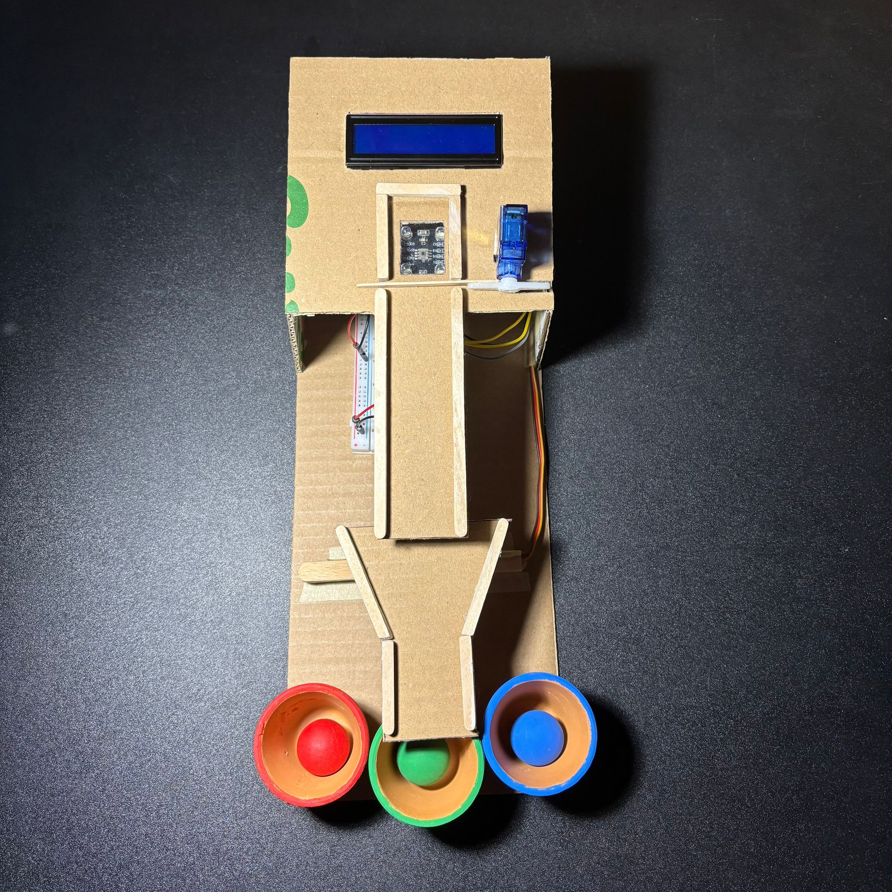
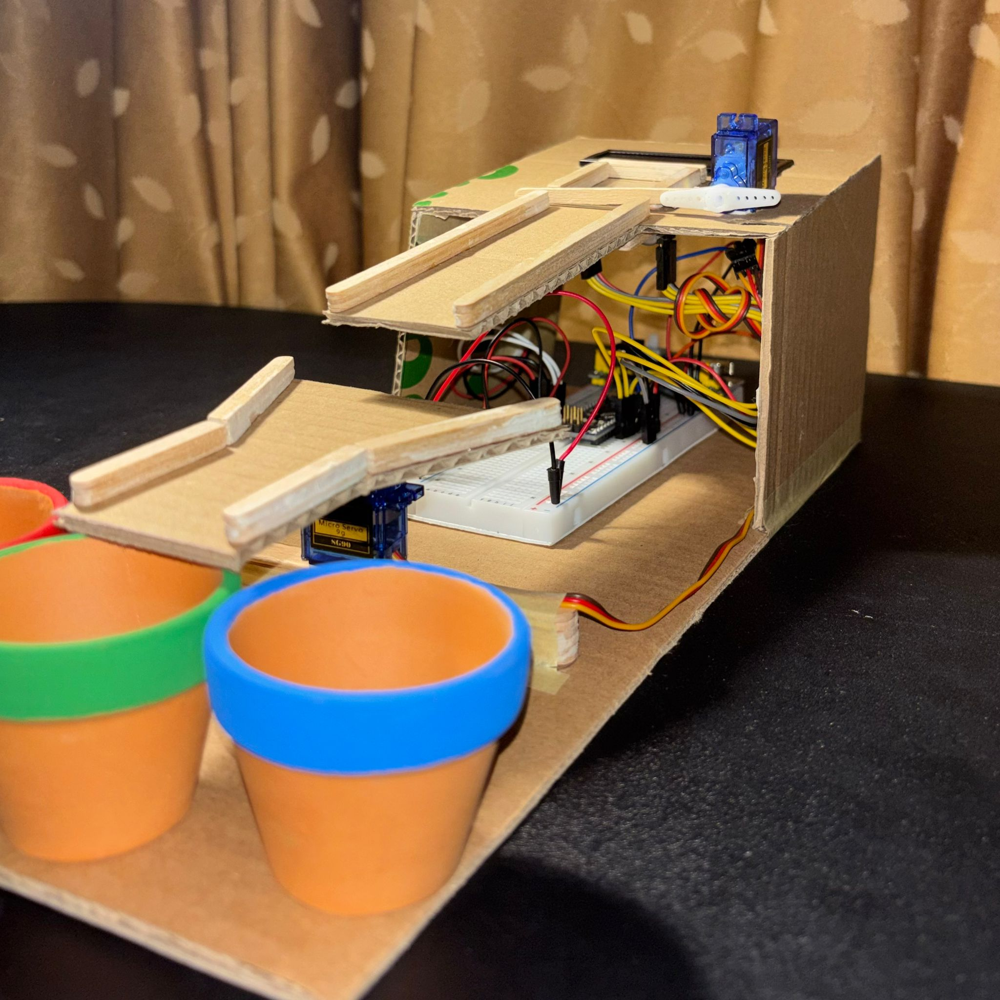
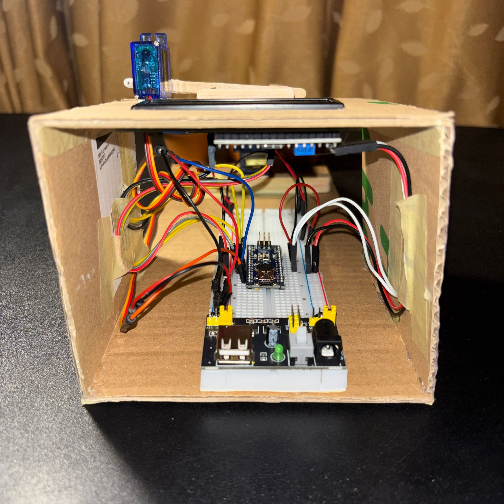

# ColorSortingSystem

This repository contains the implementation of an automated color-based ball sorting system, developed in the 3rd year at the Faculty of Mathematics and Computer Science, University of Bucharest, as part of the Introduction to Robotics course. Below you can find details on the hardware implementation, software architecture, images of the physical system, as well as a video showcasing its functionality.

  
<h2>1. Why this project?</h2>

To be honest, the decision to implement this automated color-based ball sorting system was preceded by quite a long period of "self-brainstorming", which is paradoxical considering there are countless creative robotics project ideas for beginners.

The main idea I had from the beginning was that I wanted to use components I hadn't used in my previous Arduino project (check this, you're going to love it: [MatrixProject](https://github.com/gugiutudor/MatrixProject)). Additionally, I wanted to have more fun with the physical design and implementation aspects of the project. I remembered a video I had seen on Instagram Reels a while back (see, reels aren't that bad for our brains... :D) featuring an automated system that separated green tomatoes from red ones ([tomato sorting system](https://www.youtube.com/shorts/soy-l4p1fDk)). That's how I ended up adapting the tomato sorting idea to sorting... balls.

  
<h2>2. System description. How I physically implemented it</h2>

I have 3 balls (one red, one green, one blue) that I want to sort by color. For color identification, the system uses a TCS230 color sensor, above which the balls are positioned. To keep them fixed above the sensor, I added a gate attached to an SG90 servo motor. Additionally, a ramp is attached to a second SG90 servo motor, which can be directed toward 3 containers (each corresponding to one of the 3 colors mentioned above). Thus, after the ball's color is identified, the ramp is positioned toward the corresponding container, the gate lifts, and the ball descends to its final destination.

However, I know all this because I'm the creator of this system. "How would another person know how to use your system?", you might ask. Well, for system-to-user communication, I used an LCD with an I2C module, on which specific messages are displayed according to the system's current state.

All the components mentioned above are controlled by an Arduino Nano, with connections made on a breadboard. The system is powered through a breadboard power supply (not directly through the Arduino Nano) because the servo motors require significant current at startup, and powering through the Arduino would be insufficient for proper system operation.

The components were arranged on several pieces of cardboard, using both hot glue and special cardboard tape.

### Hardware components

The components used for this project implementation were as follows:

- **TCS230 color sensor** for RGB color detection and ball identification;
- **2× SG90 servo motors** for gate mechanism and ramp positioning;
- **16x2 LCD with I2C module** for displaying system status and user instructions;
- **Arduino Nano** as the main microcontroller;
- **breadboard power supply** for stable power delivery to servo motors;
- **3 colored balls** & **3 colored pots** (red, green, blue) for sorting;
- **cardboard construction** for physical frame;
- **hot glue and cardboard tape** for assembly;
- **breadboard and wires** for connections.

*Top view showing the complete system:*

*System at operational level:*

*Breadboard, connections & cable management:*

  
<h2>3. Software implementation</h2>

For this project, I chose to use **Object-Oriented Programming (OOP)** as my paradigm to ensure clean code organization, modularity, and maintainability. The code is structured into multiple header files, each containing a dedicated class responsible for a specific aspect of the system.

<h3>Class structure:</h3>

- **ColorSensor** ([`ColorSensor.h`](ColorSortingSystem/code/ColorSortingSystem/headers/ColorSensor.h)): handles all color sensing functionality using the TCS230 sensor. Implements calibration with ambient light compensation, dynamic threshold calculation using statistical methods ([68–95–99.7 rule](https://en.wikipedia.org/wiki/68%E2%80%9395%E2%80%9399.7_rule)), ball presence detection, and robust color identification. Features adaptive thresholds that make the system environment-independent;

- **ServoController** ([`ServoController.h`](ColorSortingSystem/code/ColorSortingSystem/headers/ServoController.h)): manages both servo motors for the gate mechanism and ramp positioning. Provides smooth movement control with timing tracking, prevents simultaneous movements that could cause power issues, and offers methods for opening/closing the gate and positioning the ramp toward specific color bins;

- **LCDRenderer** ([`LCDRenderer.h`](ColorSortingSystem/code/ColorSortingSystem/headers/LCDRenderer.h)): handles all visual output on the 16x2 LCD display throughout the entire system lifecycle. Manages state-based rendering with automatic screen updates, displays calibration instructions, system status messages, detected color results, and error messages. Implements centered text printing and efficient screen redraw optimization;

- **SystemController** ([`SystemController.h`](ColorSortingSystem/code/ColorSortingSystem/headers/SystemController.h)): orchestrates the interaction between all other classes and manages the overall system flow. Implements a state machine with 9 distinct states (intro, calibration, ready, reading, show color, sorting, reset, ambient check, recalibration), handles timing for ball stabilization and movement sequences, coordinates the complete sorting workflow from detection to bin placement, and manages automatic recalibration when lighting conditions change.

<h3>Additional configuration files:</h3>

- **config.h** ([`config.h`](ColorSortingSystem/code/ColorSortingSystem/headers/config.h)): contains all constants, pin definitions, timing parameters, threshold calculation parameters, servo position settings, and system state enumerations used across multiple classes.

<h3>State machine flow:</h3>

The system operates through a well-defined state machine:

1. **STATE_INTRO**: displays welcome message and initiates ambient light calibration;
2. **STATE_CALIBRATION**: guides user through color calibration (red, green, blue balls);
3. **STATE_READY**: system ready, waiting for ball placement;
4. **STATE_READING**: stabilizes and reads ball color;
5. **STATE_SHOW_COLOR**: displays detected color to user;
6. **STATE_SORTING**: moves ramp, opens gate, and sorts ball;
7. **STATE_RESET**: closes gate and returns ramp to default position;
8. **STATE_AMBIENT_CHECK**: verifies if lighting conditions have changed;
9. **STATE_SHOW_RECALIBRATION**: informs user of recalibration need.

<h3>Key features:</h3>

- **adaptive calibration**: the system automatically adjusts to different lighting conditions by measuring ambient light and calculating dynamic thresholds based on statistical analysis (68–95–99.7 rule for noise rejection);

- **automatic recalibration**: after each sorting cycle, the system checks if ambient lighting has changed significantly. If detected, it automatically triggers recalibration to maintain accuracy;

- **robust color detection**: uses Euclidean distance in RGB color space with dynamically calculated thresholds to distinguish between colors, detect unknown/invalid colors, and determine ball presence above the sensor;

- **safe ball handling**: implements proper timing sequences to ensure balls are stabilized before reading, servos complete movements before state transitions, and the gate/ramp coordination prevents mechanical issues.

<h3>Main Arduino sketch:</h3>

- **ColorSortingSystem.ino** ([`ColorSortingSystem.ino`](ColorSortingSystem/code/ColorSortingSystem/ColorSortingSystem.ino/)): the main entry point that initializes all components and runs the system loop.

  
<h2>4. Video showcasing functionality</h2>

A video demonstration showcasing the system's functionality is available on YouTube, with timestamps included:

